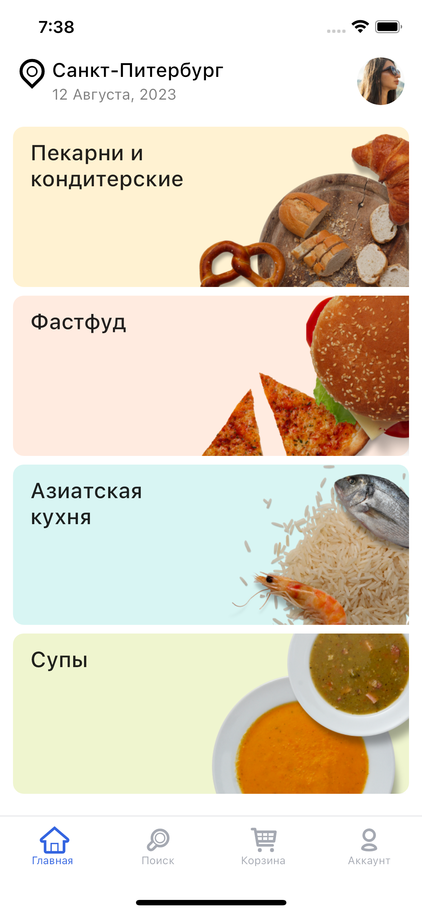
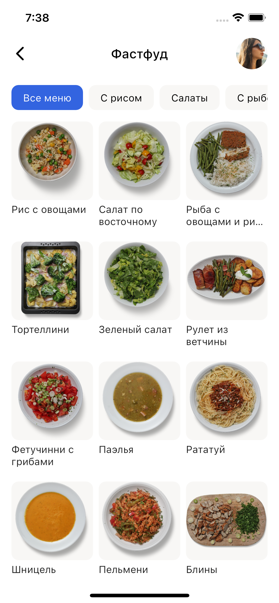
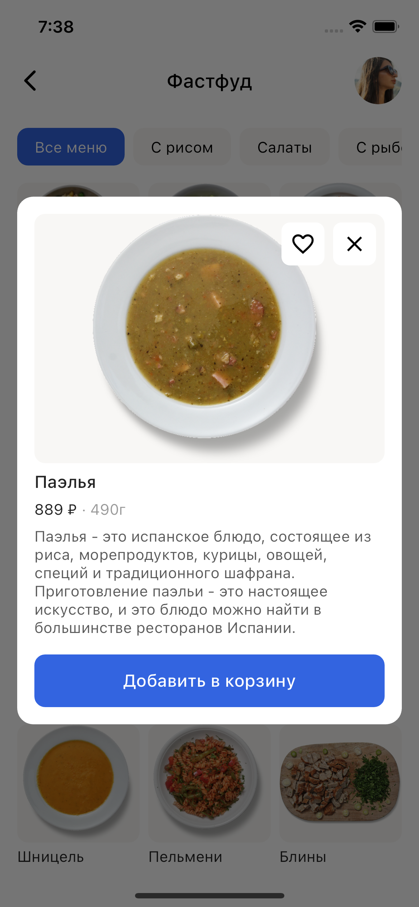
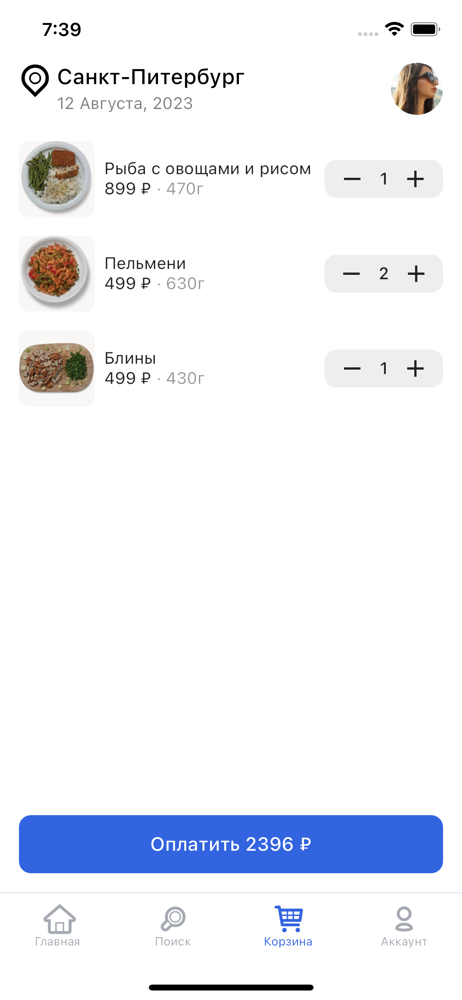

# Food Market App

A Flutter food market app.

This app uses API Mock for providing data of food.

## Build with
- flutter_bloc
- retrofit
- Clean Architecture

## Screenshots

    
    
    
    

